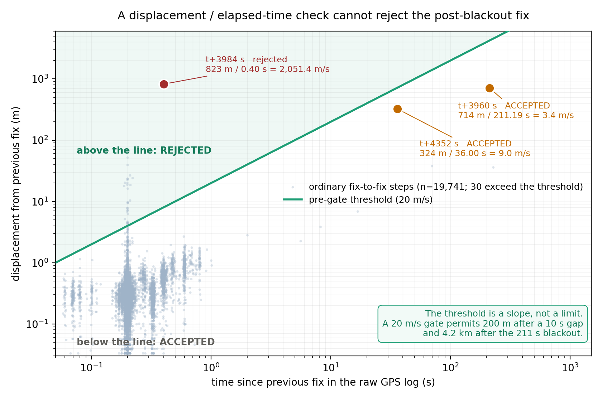
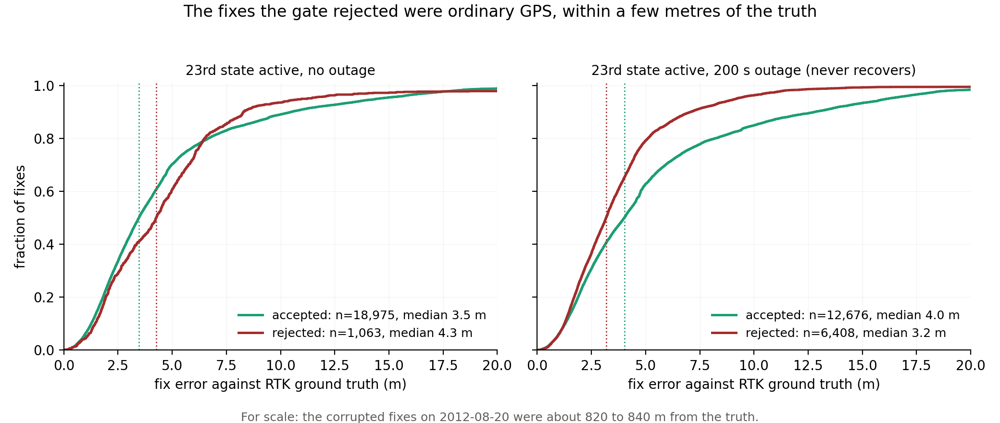
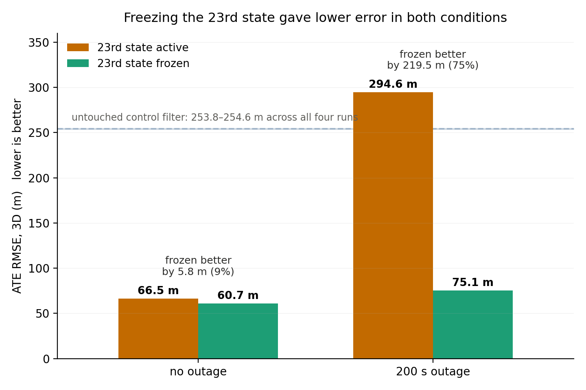
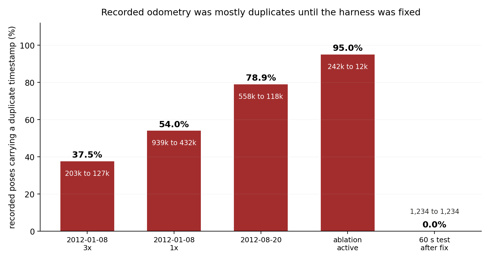

# Testing the claims of a published sensor-fusion system

[FusionCore](https://github.com/manankharwar/fusioncore) is an open-source
ROS 2 package that fuses IMU, wheel encoders, GPS and visual SLAM with a
23-state Unscented Kalman Filter. Its paper
([arXiv:2605.25239](https://arxiv.org/abs/2605.25239)) reports lower
trajectory error than `robot_localization` on ten of twelve sequences of
the NCLT dataset.

I tested three of its claims against its source code and the original
data. Two did not hold. The third did, on a different sequence from the
one the paper studied, and with worse consequences than it describes.

Full report: [`report/report.md`](report/report.md).

## 1. The proposed GPS velocity check has nothing to catch

The paper attributes its worst failure to corrupted GPS fixes slipping
past the filter's statistical outlier gate after a 211 s blackout, and
proposes an implied-speed check to stop them. It justifies this by saying
the offending fix implies about 3,400 m/s.

It implies **3.4 m/s**: 713.8 m over 211.19 s. A speed check cannot reject
it. And the statistical gate had already rejected it at more than five times its
threshold, along with every other fix in the corrupted cluster, which sat
about 820 to 840 m from the truth.

The check has a structural problem too. Dividing displacement by the time
since the last fix gives a limit that grows with the blackout: a 20 m/s
threshold allows 4.2 km of movement after 211 s.

Animated: [the check's allowance growing with the gap](animations/threshold.mp4).

## 2. The paper's failure does happen: on another sequence, and worse

On 2012-08-20, the sequence the paper analyses, the gate held. On 2012-01-08
it didn't. After a real 112-second signal loss, the GPS receiver's first fix
came back 157 m from the truth, and the filter's inflated uncertainty let it
through. The proposed velocity check would have passed it too: 166 m in
112 s is 1.48 m/s.

Accepting that fix collapsed the filter's uncertainty at the wrong place, so
the good fixes that followed were rejected: around a thousand in a row in
every run, and in one run for the last 2,000 seconds of the sequence. The
rejected fixes were ordinary GPS, within a few metres of RTK ground truth
(median 4.8 m, against 3.5 m for accepted fixes).

Full-resolution video and a text transcript: [`animations/`](animations/). Static version for all four runs: [`figures/fig_lockout.png`](figures/fig_lockout.png).

This explains the few-hundred-metre excursions that inflate every
full-length run: they are the moment a lockout ends and the estimate snaps
back. The repository's outage injector can't reproduce any of it, because
it deletes fixes while the receiver keeps its signal, so the fix after an
injected outage is as good as any other.

## 3. No evidence the novel state helps

The paper's one new contribution is a 23rd filter state estimating the
wheel encoders' yaw-rate bias. Its evaluation never isolates it: the state
was added in the same step as a change to the test sequences.

I built a switch that freezes that state and changes nothing else, then ran
four matched runs. An untouched baseline filter running alongside agreed to
within 0.8 m across all four, confirming the runs are comparable.

The state didn't improve accuracy in either condition. Freezing it gave
lower error with GPS available (9%) and across a 200 s outage (75%).

Both differences trace back to the lockouts. In the outage runs, the frozen
arm escaped its lockout after about 450 seconds; the active arm never did.
Escaping is knife-edge: the two arms drifted by similar amounts while
coasting blind (198 m and 170 m), and the difference in outcome came from
the direction of the drift. With one run per configuration this can't show
whether the state *systematically* makes lockouts worse. What it does show
is that the claimed improvement isn't supported.

## 4. The benchmark harness recorded mostly duplicates

Between 38% and 95% of recorded odometry carried duplicate timestamps, the
data player never exited, and the launch never shut down. I fixed all
three, plus a fourth problem they were hiding. The published error figures
are unaffected, because the evaluation matches poses by timestamp, but
anything based on message counts is not.

## Also found

The paper and its code disagree in four places. The encoder measurement
equation in the paper subtracts the bias; the code adds it. The abstract
describes the bias being subtracted during GPS blackouts; no such code path
exists. The paper attributes a failure to a recovery mode that the benchmark
configuration switches off, with a comment explaining it was disabled for
causing that failure. And the novel state is observable only through GPS,
which the paper does not state.

## Limits

- Why the author's runs apparently don't lock out is not established.
- Every controlled experiment used injected outages, which don't reproduce
  the corrupted fixes a real receiver produces when it re-acquires.
- One sequence for the ablation, one run per configuration. Playback is
  deterministic, so repeats would be identical, but this does not
  generalise beyond that sequence.
- The lockouts inflate my absolute error figures well above the paper's.
  Compare configurations with each other, not with the paper.
- The `robot_localization` baseline scores 5 to 20 times worse on my setup
  than in the paper, for reasons I did not investigate.
- The mechanism behind the duplicate timestamps is not established. The
  measurement and the fix are.

## Contents

| | |
|---|---|
| [`report/`](report/report.md) | The full report |
| [`animations/`](animations/) | The lockout and the velocity check, animated, with transcripts |
| [`results/`](results/benchmark_tables.md) | Every number, with the run that produced it |
| [`scripts/`](scripts/README.md) | Analysis and figure scripts, and how to reproduce |
| [`patches/`](patches/) | The code changes to FusionCore |
| Code | [Branch `verification` on my fork](https://github.com/rustamoz/fusioncore/tree/verification), [all changes on one page](https://github.com/rustamoz/fusioncore/compare/99503ca...verification) |

## Credit

FusionCore is by Manan Kharwar, Apache 2.0. The NCLT dataset is from the
University of Michigan (Carlevaris-Bianco, Ushani and Eustice, 2016) and is
released under the Open Database License; none of it is redistributed here.
See [`NOTICE.md`](NOTICE.md).
