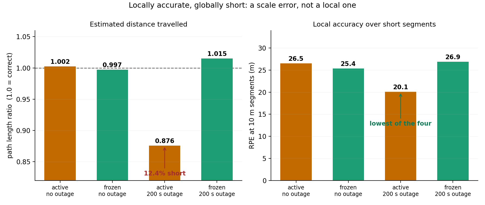

# Testing the claims of a published sensor-fusion system

[FusionCore](https://github.com/manankharwar/fusioncore) is an open-source
ROS 2 package that fuses IMU, wheel encoders, GPS and visual SLAM with a
23-state Unscented Kalman Filter. Its paper
([arXiv:2605.25239](https://arxiv.org/abs/2605.25239)) reports lower
trajectory error than `robot_localization` on ten of twelve sequences of
the NCLT dataset.

I tested three of its claims against its source code and the original
data. Two did not hold.

## 1. The proposed GPS velocity check has nothing to catch

The paper attributes its worst failure to corrupted GPS fixes slipping
past the filter's statistical outlier gate after a 211 s blackout, and
proposes an implied-speed check to stop them. It justifies this by saying
the offending fix implies about 3,400 m/s.

It implies **3.4 m/s**: 713.8 m over 211.19 s. A speed check cannot reject
it. And the statistical gate had already rejected it, at five times its
threshold, along with all 2,862 corrupted fixes on that sequence. The
error in that stretch is dead-reckoning drift while GPS was correctly
refused.

The check has a structural problem too. Dividing displacement by the time
since the last fix gives a limit that grows with the blackout: a 20 m/s
threshold allows 4.2 km of movement after 211 s.

## 2. The paper's novel state makes accuracy worse

The paper's one new contribution is a 23rd filter state estimating the
wheel encoders' yaw-rate bias. Its evaluation never isolates it: the state
was added in the same step as a change to the test sequences.

I built a switch that freezes that state and changes nothing else, then ran
four matched runs. An untouched baseline filter running alongside agreed to
within 0.8 m across all four, confirming the runs are comparable.

Freezing the state reduced trajectory error by **9%** with GPS available and
by **75%** across a 200 s GPS outage.

The mechanism is a 12% contraction of the estimated path. Locally the
trajectory is accurate; it is the accumulated distance that comes up short.
The state can only be corrected by GPS, so during a blackout it is applied
to every encoder measurement with nothing able to fix it, and the filter's
own health metrics show nothing wrong.

## 3. The benchmark harness recorded mostly duplicates

Between 38% and 95% of recorded odometry carried duplicate timestamps, the
data player never exited, and the launch never shut down. I fixed all three.
The published error figures are unaffected, because the evaluation matches
poses by timestamp, but anything based on message counts is not.

## Also found

The paper and its code disagree in four places. The encoder measurement
equation in the paper subtracts the bias; the code adds it. The abstract
describes the bias being subtracted during GPS blackouts; no such code path
exists. The paper attributes a failure to a recovery mode that the benchmark
configuration switches off, with a comment explaining it was disabled for
causing that failure. And the novel state is observable only through GPS,
which the paper does not state.

## Limits

- One sequence for the ablation, one run per configuration. Playback is
  deterministic, so repeats would be identical, but this does not
  generalise beyond that sequence.
- Every full-length run on my machine develops a few-hundred-metre
  excursion that I could not explain, so my absolute error figures are
  higher than the paper's. It affects both arms of each comparison
  equally, so the comparisons hold.
- The `robot_localization` baseline scores 5 to 20 times worse on my setup
  than in the paper, for reasons I did not investigate.
- The mechanism behind the duplicate timestamps is not established. The
  measurement and the fix are.

## Contents

| | |
|---|---|
| [`results/`](results/benchmark_tables.md) | Every number, with the run that produced it |
| [`scripts/`](scripts/README.md) | Analysis and figure scripts, and how to reproduce |
| [`patches/`](patches/) | The code changes to FusionCore |
| [`report/`](report/) | The full report |
| Code | [Branch `verification` on my fork](https://github.com/rustamoz/fusioncore/tree/verification), [all changes on one page](https://github.com/rustamoz/fusioncore/compare/99503ca...verification) |

## Credit

FusionCore is by Manan Kharwar, Apache 2.0. The NCLT dataset is from the
University of Michigan (Carlevaris-Bianco, Ushani and Eustice, 2016) and is
released under the Open Database License; none of it is redistributed here.
See [`NOTICE.md`](NOTICE.md).
